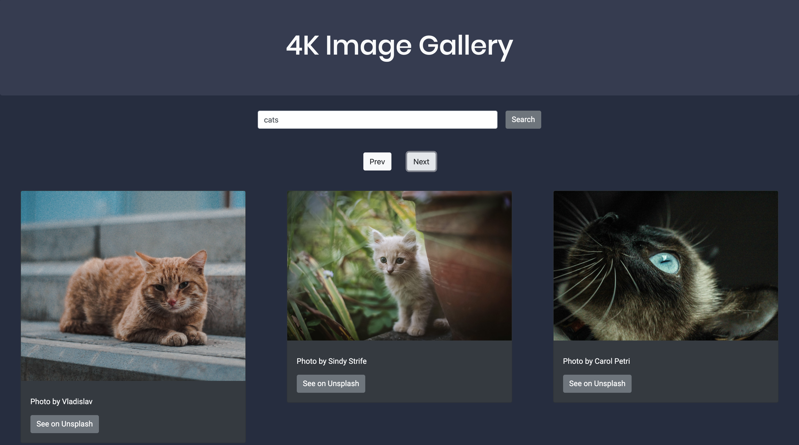

# 4K Image Gallery - Built by Ian Schwartz

# Overview 

This image gallery utilizes the Unsplash API to allow the user to search and browse photos. It is a fully responsive application that aims to support accessibility.

<strong>Front End Deployment: https://4kimagegallery.netlify.app/  
  Unsplash API: https://unsplash.com/developers
</strong>

 # Tech

### • React

### • React Bootstrap

### • Sass

### • Netlify

This application was deployed with Netlify.

### • Third-Party Packages

For a full list of all the third-party npm packages used please visit [this file](https://github.com/ian-schwartz/image-gallery/blob/master/image-gallery-app/package.json)
